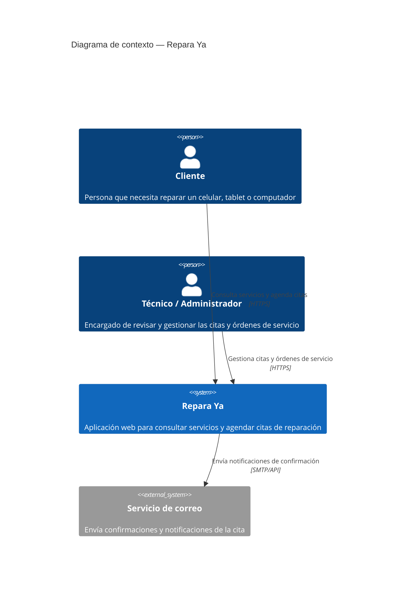
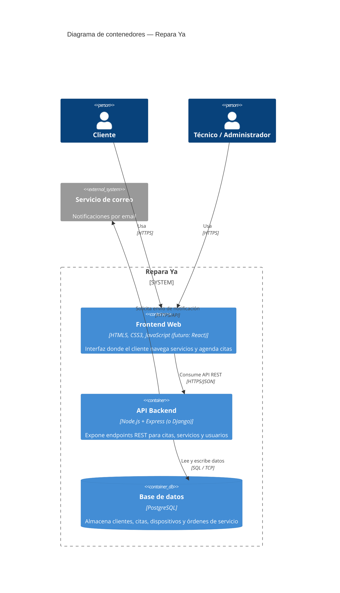

# Repara Ya

Proyecto integrador — **Avance 1: arquitectura, maquetación y validación**.

Repara Ya es un servicio técnico de reparación de celulares, tablets y computadores. La aplicación web permite a un cliente conocer los servicios disponibles y agendar una cita de diagnóstico, y a un administrador del taller gestionar esas solicitudes.

Este primer avance cubre:

- Definición de arquitectura con el estándar **C4** (niveles 1 y 2).
- Maquetación de 3 vistas principales con HTML5 semántico y CSS3 puro, responsivas.
- Validación de formulario con JavaScript puro (sin librerías).

---

## 1. Arquitectura propuesta (C4)

### Nivel 1 — Diagrama de contexto

Muestra a Repara Ya como sistema y quiénes interactúan con él.



### Nivel 2 — Diagrama de contenedores

Muestra los grandes bloques técnicos del sistema y cómo se comunican.



> Los diagramas están en formato **Mermaid** y se renderizan automáticamente en la vista de este archivo en GitHub. También pueden verse en [mermaid.live](https://mermaid.live) pegando el bloque de código correspondiente.

### Componentes y tecnologías por capa

| Capa | Componente | Tecnología propuesta | Comunicación |
|---|---|---|---|
| Cliente | Frontend Web | HTML5, CSS3 (Grid/Flexbox), JavaScript. Migración planeada a **React** | Consume la API vía HTTPS |
| Servidor | API Backend | **Node.js + Express** (alternativa: Django + DRF) | Recibe peticiones HTTP/HTTPS del frontend, responde en JSON |
| Datos | Base de datos | **PostgreSQL** | Conexión TCP/SQL desde el backend |
| Externo | Notificaciones | Servicio de correo (ej: SendGrid) | El backend lo consume vía API/SMTP |

En esta primera entrega solo se implementó la capa de **frontend** (maquetación y validación en el navegador); backend y base de datos quedan definidos a nivel de arquitectura para las siguientes entregas.

---

## 2. Maquetación de vistas

Se maquetaron 3 vistas principales, todas responsivas (móvil, tablet y escritorio) usando **CSS Grid y Flexbox** con media queries, sin frameworks CSS:

| Vista | Archivo | Contenido |
|---|---|---|
| Inicio | `index.html` | Hero con propuesta de valor, categorías de reparación, proceso del taller en 4 pasos |
| Servicios | `servicios.html` | Tabla de precios de celulares y tarjetas de servicios para tablets/computadores |
| Agendar cita | `agendar.html` | Formulario de solicitud de cita con validación en JavaScript |

Puntos de quiebre responsivos: `900px` (tablet) y `640px` (móvil), definidos en `css/style.css`.

---

## 3. Validación con JavaScript

El formulario de **Agendar cita** (`agendar.html`) valida en el cliente, sin recargar la página:

- **Campos obligatorios:** nombre, correo, teléfono, tipo de dispositivo y descripción de la falla.
- **Formato de correo:** expresión regular que exige `usuario@dominio.ext`.
- **Formato de teléfono:** solo dígitos, entre 7 y 10 caracteres.
- **Longitud mínima:** nombre (3 caracteres) y descripción de la falla (10 caracteres).
- **Mensajes de error** específicos por campo, mostrados debajo de cada input.
- **Eventos manejados:** `submit` (valida todo y evita el envío si hay errores), `blur` (valida al salir del campo) e `input` (limpia el error mientras el usuario corrige).
- Al validar correctamente, se muestra un mensaje de confirmación y el formulario se reinicia.

Lógica en `js/validation.js`; el menú móvil (independiente de la validación) está en `js/main.js`.

---

## Estructura del repositorio

```
repara-ya/
├── index.html
├── servicios.html
├── agendar.html
├── css/
│   └── style.css
├── js/
│   ├── main.js
│   └── validation.js
├── assets/
│   └── logo.png
└── README.md
```

## Instrucciones de uso

1. Clonar el repositorio.
2. Abrir `index.html` en el navegador (no requiere instalación ni servidor).
   - Recomendado: extensión **Live Server** de VS Code para recarga automática.
3. Navegar entre las vistas desde el menú superior.
4. Probar el formulario en `agendar.html`: enviarlo vacío para ver los mensajes de error, y luego completarlo correctamente para ver la confirmación.

## Próximos avances

- Implementación del backend (API REST) según el diagrama de contenedores.
- Conexión a base de datos PostgreSQL.
- Migración del frontend a React manteniendo la misma estructura de vistas.
